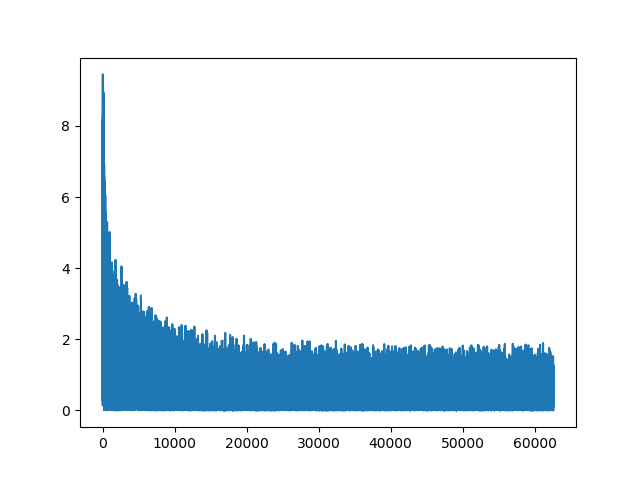
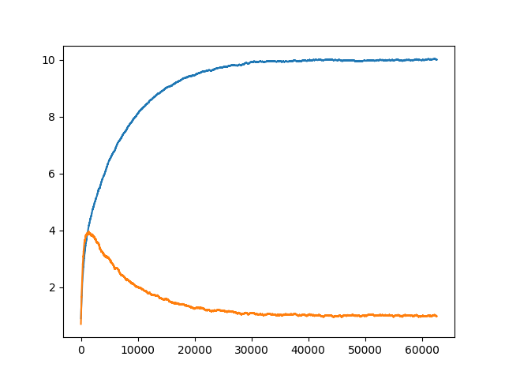

## Градиентный спуск 

<b>Постановка задачи:</b> Дан набор точек , надо найти коэффициенты    для функции прямой типа
.  

<b>Решим</b> задачу методом градиентного спуска, по ошибке равной средней квадратичной (НКО), тогда функция ошибки f будет равна

.  

Зная некоторые 
 
и  
 мы можем найти:
 
  
 
  
 
Раскроем частные производные: 

  
 
  
 

#### Результаты работы 

 
*Изменение ошибки градиентного спуска*
    
    
 
*Изменение k и l по мере градиентного спуска*

 

 

#### Структура проекта

* [X] linear_eq.py - работа апроксиматора без применения библиотеки tensorflow
     
     <b>Запуск:</b>
            
            >> cd <dir>/gradient_descent_linear_eq    
            >> python linear_eq.py
                 
  
     
     
* [X] [linear_eq_tensorflow.py](linear_eq_tensorflow.py) - работа апроксиматора с применением библиотеки tensorflow, с показом результатов через tensorboard 
     
     Поиск частных производных для градиентного спуска производится автоматически библиотекой tensorflow
     
     <b>Запуск:</b>
     
            >> cd <dir>/gradient_descent_linear_eq
            >> python linear_eq_tensorflow.py
            >> tensorboard --logdir=log/linear_eq_tensorflow/tmp 
        
     далее пройти по ссылке: [http://localhost:6006](http://localhost:6006)
