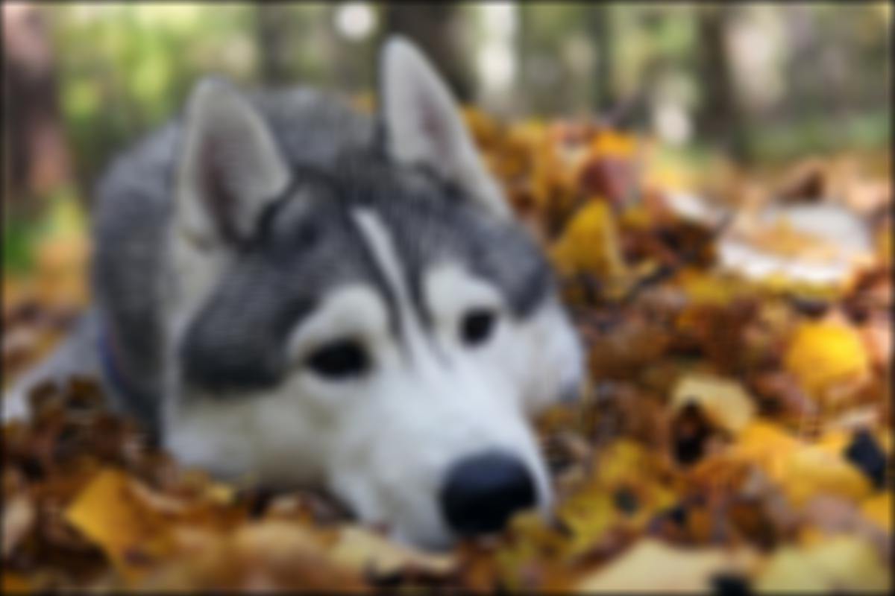
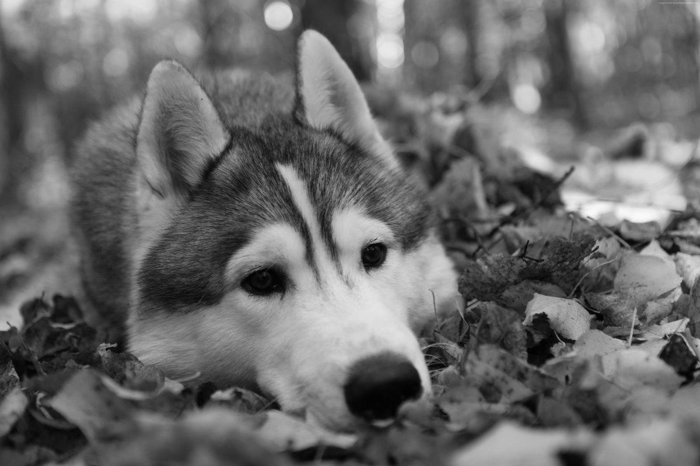
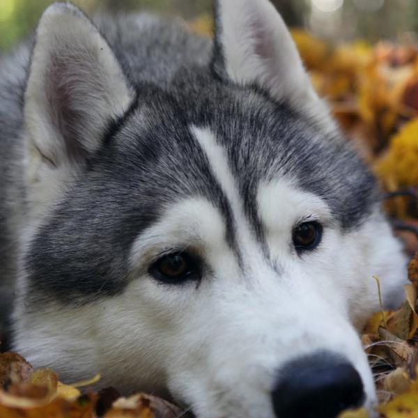

## Обработка изображении 

Знакомство с методами обработки изображения с использованием tensorflow. Рассмотрим способы работы со сверточными нейронными сетями TensorFlow на примере сверток изображения (фильтров). 

Конвертация изображения в требуемую тразмерность:
 [NHWC to NCHW](https://stackoverflow.com/questions/37689423/convert-between-nhwc-and-nchw-in-tensorflow)
 
 
#### Размытие

Наиболее простой способ сделать размытие - Box фильтр
 
    

#### Затемнение

Сумма элементов ядра Box фильтра должны в сумме = 1. Исли меньше 1, то будет затемненение  
 
    

#### Освещение

Сумма элементов ядра Box фильтра должны в сумме = 1. Исли больше 1, то будет засвет
 
    
 
 
#### Сохранение размера
 
При применении сверточных сетей можно сохранять размер с помощью флага SAME - 
однако с ним появляется затемненная рамка в изображении  
 
   
 
#### Черно-белый фильтр
  
   

 
#### Обрезка

с использованием keras
  
   

#### Приведение к размеру масштабированием

с использованием keras
  
   
